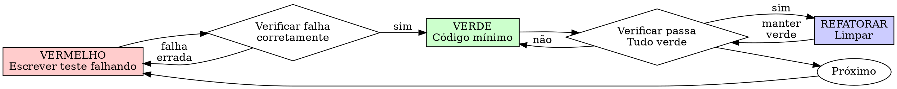

# Desenvolvimento Orientado por Testes (TDD)

## Visão Geral

Escreva o teste primeiro. Veja-o falhar. Escreva o código mínimo para passar.

**Princípio central:** Se você não viu o teste falhar, não sabe se ele testa a coisa certa.

**Violar a letra das regras é violar o espírito das regras.**

## Quando Usar

**Sempre:**
- Novas funcionalidades
- Correções de bugs
- Refatoração
- Mudanças de comportamento

**Exceções (pergunte ao seu parceiro humano):**
- Protótipos descartáveis
- Código gerado
- Arquivos de configuração

Está pensando em "pular o TDD só desta vez"? Pare. Isso é racionalização.

## A Lei de Ferro

```
NENHUM CÓDIGO DE PRODUÇÃO SEM UM TESTE FALHANDO PRIMEIRO
```

Escreveu código antes do teste? Delete. Comece de novo.

**Sem exceções:**
- Não mantenha como "referência"
- Não "adapte" enquanto escreve os testes
- Não olhe para ele
- Deletar significa deletar

Implemente do zero a partir dos testes. Ponto final.

## Vermelho-Verde-Refatora



### VERMELHO - Escrever Teste Falhando

Escreva um teste mínimo mostrando o que deveria acontecer.

<Bom>
```typescript
test('tenta novamente operações falhas 3 vezes', async () => {
  let tentativas = 0;
  const operacao = () => {
    tentativas++;
    if (tentativas < 3) throw new Error('falha');
    return 'sucesso';
  };

  const resultado = await tentarNovamente(operacao);

  expect(resultado).toBe('sucesso');
  expect(tentativas).toBe(3);
});
```
Nome claro, testa comportamento real, uma coisa só
</Bom>

<Ruim>
```typescript
test('tentativa funciona', async () => {
  const mock = jest.fn()
    .mockRejectedValueOnce(new Error())
    .mockRejectedValueOnce(new Error())
    .mockResolvedValueOnce('sucesso');
  await tentarNovamente(mock);
  expect(mock).toHaveBeenCalledTimes(3);
});
```
Nome vago, testa mock não o código
</Ruim>

**Requisitos:**
- Um comportamento
- Nome claro
- Código real (sem mocks a menos que inevitável)

### Verificar VERMELHO - Ver a Falha

**OBRIGATÓRIO. Nunca pule.**

```bash
npm test caminho/para/teste.test.ts
```

Confirme:
- Teste falha (não dá erro)
- Mensagem de falha é a esperada
- Falha porque funcionalidade está faltando (não por erros de digitação)

**Teste passou?** Você está testando comportamento existente. Corrija o teste.

**Teste deu erro?** Corrija o erro, execute novamente até falhar corretamente.

### VERDE - Código Mínimo

Escreva o código mais simples para passar no teste.

<Bom>
```typescript
async function tentarNovamente<T>(fn: () => Promise<T>): Promise<T> {
  for (let i = 0; i < 3; i++) {
    try {
      return await fn();
    } catch (e) {
      if (i === 2) throw e;
    }
  }
  throw new Error('inalcançável');
}
```
Apenas o suficiente para passar
</Bom>

<Ruim>
```typescript
async function tentarNovamente<T>(
  fn: () => Promise<T>,
  opcoes?: {
    maxTentativas?: number;
    backoff?: 'linear' | 'exponential';
    aoTentar?: (tentativa: number) => void;
  }
): Promise<T> {
  // YAGNI (Você não vai precisar disso)
}
```
Superengenharia
</Ruim>

Não adicione funcionalidades, refatore outro código ou "melhore" além do teste.

### Verificar VERDE - Ver Passar

**OBRIGATÓRIO.**

```bash
npm test caminho/para/teste.test.ts
```

Confirme:
- Teste passa
- Outros testes ainda passam
- Saída limpa (sem erros, avisos)

**Teste falhou?** Corrija o código, não o teste.

**Outros testes falharam?** Corrija agora.

### REFATORAR - Limpar

Após o verde apenas:
- Remova duplicação
- Melhore nomes
- Extraia helpers

Mantenha os testes verdes. Não adicione comportamento.

### Repetir

Próximo teste falhando para a próxima funcionalidade.

## Bons Testes

| Qualidade | Bom | Ruim |
|-----------|-----|------|
| **Mínimo** | Uma coisa. "e" no nome? Divida. | `test('valida email e domínio e espaço')` |
| **Claro** | Nome descreve comportamento | `test('teste1')` |
| **Mostra intenção** | Demonstra a API desejada | Obscurece o que o código deveria fazer |

## Compatibilidade Cross-Platform

Testes devem passar em qualquer sistema operacional sem modificação.

**Paths de sistema de arquivos:**
- Construa caminhos com APIs da plataforma (`path.join`, `path.resolve`). Nunca concatene com `/` ou `\`.
- ❌ `const p = basePath + '/covers/' + filename`
- ✅ `const p = path.join(basePath, 'covers', filename)`

**Asserções de path:**
- Não compare strings de caminho com separadores fixos.
- ❌ `expect(result.filePath).toContain('/covers/')`
- ✅ `expect(result.filePath).toContain(path.join('sources', id, 'covers'))`

**Mocks de I/O de arquivos:**
- Mocks que armazenam paths como chaves (ex.: `Map<string, ...>`) devem usar a mesma convenção de path do código testado. Normalize separadores com `replace(/\\/g, '/')` para buscas por prefixo.

## Isolamento de Recursos

Testes não devem deixar rastros no ambiente.

**Diretórios temporários:**
- Use `os.tmpdir()` + sufixo aleatório para storage de teste. Nunca escreva em paths de desenvolvimento/produção.
- Remova diretórios temporários ao final (`afterAll` ou `globalTeardown`).

**Banco de dados:**
- Testes de integração usam banco de dados dedicado (ex.: `_test_db`), nunca o banco de desenvolvimento.
- Limpe registros entre testes (`beforeEach deleteMany`).

**Limpeza automática:**
- Todo recurso criado por um teste (arquivo, diretório, registro de BD) deve ser removido ao final, independentemente de o teste passar ou falhar.

## Singletons e Efeitos Colaterais de Módulo

A mera importação de um módulo não deve causar efeitos colaterais que impeçam a execução de testes.

**Conexões e clients:**
- Evite inicializar conexões de banco, Redis ou HTTP no `import` do módulo. Prefira factories ou inicialização lazy.
- ❌ `export const prisma = new PrismaClient()` no nível do módulo
- ✅ `let _client: PrismaClient; export function getClient() { ... }` com inicialização sob demanda

**Variáveis de ambiente:**
- O arquivo de ambiente de teste (`.env.test`) deve definir todas as variáveis obrigatórias (sem valor default no schema).
- Um `safeParse` que crasha no `import` impede qualquer teste de executar.

## Execução Paralela

Se a suíte executa testes em paralelo (`fileParallelism > 1`), garanta que recursos compartilhados não causem conflitos.

**Recursos por worker:**
- Cada worker deve usar diretórios, portas e namespaces de banco independentes.
- Use `pool: 'forks'` para isolamento de memória entre workers.
- Considere desabilitar paralelismo quando os testes compartilham estado global.

## Por Que a Ordem Importa

**"Vou escrever os testes depois para verificar se funciona"**

Testes escritos após o código passam imediatamente. Passar imediatamente não prova nada:
- Podem testar a coisa errada
- Podem testar implementação, não comportamento
- Podem perder casos de borda que você esqueceu
- Você nunca viu o teste pegar o bug

Test-first força você a ver o teste falhar, provando que ele realmente testa algo.

**"Já testei manualmente todos os casos de borda"**

Teste manual é ad-hoc. Você acha que testou tudo mas:
- Não há registro do que foi testado
- Não pode reexecutar quando o código muda
- Fácil esquecer casos sob pressão
- "Funcionou quando tentei" ≠ abrangente

Testes automatizados são sistemáticos. Executam da mesma forma toda vez.

**"Deletar X horas de trabalho é desperdício"**

Falácia do custo irrecuperável. O tempo já se foi. Sua escolha agora:
- Deletar e reescrever com TDD (mais X horas, alta confiança)
- Manter e adicionar testes depois (30 min, baixa confiança, prováveis bugs)

O "desperdício" é manter código em que você não pode confiar. Código funcional sem testes reais é dívida técnica.

**"TDD é dogmático, ser pragmático significa adaptar"**

TDD É pragmático:
- Encontra bugs antes do commit (mais rápido que debug após)
- Previne regressões (testes pegam quebras imediatamente)
- Documenta comportamento (testes mostram como usar o código)
- Permite refatoração (mude livremente, testes pegam quebras)

Atalhos "pragmáticos" = debuggar em produção = mais lento.

**"Testes depois alcançam os mesmos objetivos — é o espírito não o ritual"**

Não. Testes-depois respondem "O que isso faz?" Testes-primeiro respondem "O que isso deveria fazer?"

Testes-depois são enviesados pela sua implementação. Você testa o que construiu, não o que é necessário. Você verifica casos de borda lembrados, não descobertos.

Testes-primeiro forçam descoberta de casos de borda antes de implementar. Testes-depois verificam se você lembrou de tudo (não lembrou).

30 minutos de testes depois ≠ TDD. Você ganha cobertura, perde a prova de que os testes funcionam.

## Racionalizações Comuns

| Desculpa | Realidade |
|----------|-----------|
| "Simples demais para testar" | Código simples quebra. Teste leva 30 segundos. |
| "Vou testar depois" | Testes passando imediatamente não provam nada. |
| "Testes depois alcançam mesmos objetivos" | Testes-depois = "o que isso faz?" Testes-primeiro = "o que isso deveria fazer?" |
| "Já testei manualmente" | Ad-hoc ≠ sistemático. Sem registro, não pode reexecutar. |
| "Deletar X horas é desperdício" | Falácia do custo irrecuperável. Manter código não verificado é dívida técnica. |
| "Manter como referência, escrever testes primeiro" | Você vai adaptar. Isso é testar depois. Deletar significa deletar. |
| "Preciso explorar primeiro" | Tudo bem. Jogue fora a exploração, comece com TDD. |
| "Teste difícil = design confuso" | Ouça o teste. Difícil de testar = difícil de usar. |
| "TDD vai me atrasar" | TDD é mais rápido que debug. Pragmático = test-first. |
| "Teste manual é mais rápido" | Manual não prova casos de borda. Você vai retestar cada mudança. |
| "Código existente não tem testes" | Você está melhorando. Adicione testes para código existente. |

## Bandeiras Vermelhas - PARE e Recomece

- Código antes do teste
- Teste após implementação
- Teste passa imediatamente
- Não consegue explicar por que o teste falhou
- Testes adicionados "depois"
- Racionalizando "só desta vez"
- "Já testei manualmente"
- "Testes depois alcançam o mesmo propósito"
- "É sobre o espírito não o ritual"
- "Manter como referência" ou "adaptar código existente"
- "Já gastei X horas, deletar é desperdício"
- "TDD é dogmático, estou sendo pragmático"
- "Isso é diferente porque..."

**Tudo isso significa: Delete o código. Recomece com TDD.**

## Exemplo: Correção de Bug

**Bug:** Email vazio aceito

**VERMELHO**
```typescript
test('rejeita email vazio', async () => {
  const resultado = await enviarFormulario({ email: '' });
  expect(resultado.erro).toBe('Email obrigatório');
});
```

**Verificar VERMELHO**
```bash
$ npm test
FALHOU: esperado 'Email obrigatório', recebeu undefined
```

**VERDE**
```typescript
function enviarFormulario(dados: DadosFormulario) {
  if (!dados.email?.trim()) {
    return { erro: 'Email obrigatório' };
  }
  // ...
}
```

**Verificar VERDE**
```bash
$ npm test
PASSOU
```

**REFATORAR**
Extraia validação para múltiplos campos se necessário.

## Checklist de Verificação

Antes de marcar o trabalho como concluído:

- [ ] Cada nova função/método tem um teste
- [ ] Viu cada teste falhar antes de implementar
- [ ] Cada teste falhou pelo motivo esperado (funcionalidade faltando, não erro de digitação)
- [ ] Escreveu código mínimo para passar em cada teste
- [ ] Todos os testes passam
- [ ] Saída limpa (sem erros, avisos)
- [ ] Testes usam código real (mocks apenas se inevitável)
- [ ] Casos de borda e erros cobertos

Não consegue marcar todas as caixas? Você pulou TDD. Recomece.

## Quando Estiver Travado

| Problema | Solução |
|----------|---------|
| Não sabe como testar | Escreva a API desejada. Escreva a asserção primeiro. Pergunte ao seu parceiro humano. |
| Teste complicado demais | Design complicado demais. Simplifique a interface. |
| Precisa mockar tudo | Código muito acoplado. Use injeção de dependência. |
| Setup do teste enorme | Extraia helpers. Ainda complexo? Simplifique o design. |

## Integração com Depuração

Encontrou um bug? Escreva um teste falhando que o reproduza. Siga o ciclo TDD. O teste prova a correção e previne regressão.

Nunca corrija bugs sem um teste.

## Anti-Padrões de Teste

Ao adicionar mocks ou utilitários de teste, leia [testing-anti-patterns.md](testing-anti-patterns.md) para evitar armadilhas comuns:
- Testar comportamento de mock em vez de comportamento real
- Adicionar métodos apenas para teste em classes de produção
- Mockar sem entender as dependências

## Regra Final

```
Código de produção → teste existe e falhou primeiro
Caso contrário → não é TDD
```

Sem exceções sem a permissão do seu parceiro humano.
